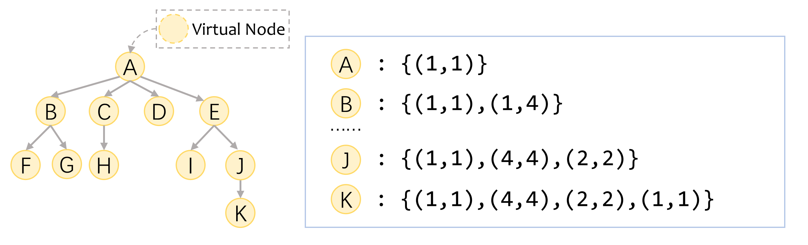

This is an official Pytorch implementation of the approach proposed in:
> Han Peng, Ge Li, Yunfei Zhao, Zhi Jin *“Rethinking Positional Encoding in Tree Transformer for Code Representation”* 

which appeared at **EMNLP 2022**[[Paper Link]()][[Poster](https://s3.amazonaws.com/pf-user-files-01/u-59356/uploads/2022-11-01/o023umd/emnlp.pdf)].


We propose a new tree Transformer encoding position for each node based on our novel two-dimensional description of tree structures. 
Technically, our model introduces soft bias as the positional encoding of Transformer in global and local ways. 
Our model finally outperforms strong baselines on code summarization and completion tasks across two different languages.


Please cite our paper if you use the model, experimental results, or our code in your own work.

Our code is built on the [code repository](https://github.com/bayesgroup/code_transformers) released by 
__Empirical Study of Transformers for Source Code__ (accepted to [ESEC/FSE'21](https://2021.esec-fse.org/)).
Please also cite this paper if you use the code in your work.

Due to time, we did not re-organize our code carefully.
However, since we built our code on the unified interface of the original [code repository](https://github.com/bayesgroup/code_transformers), it should not be difficult to understand and use our code.
Besides, since our approach is not complicated, we think it should be relatively simple to re-implement in your experiments.


**Contact**
If you have any questions, please contact me via email: phan@pku.edu.cn or open issues on GitHub.


--------------------------
This part is the original readme text of [code repository](https://github.com/bayesgroup/code_transformers) for 
__Empirical Study of Transformers for Source Code__.

## Transformers for variable misuse, function naming and code completion tasks

The official PyTorch implementation of:
* __Empirical Study of Transformers for Source Code__ [[arxiv](https://arxiv.org/abs/2010.07987)] (accepted to [ESEC/FSE'21](https://2021.esec-fse.org/))
* __A Simple Approach for Handling Out-of-Vocabulary Identifiers in Deep Learning for Source Code__ [[arxiv](https://arxiv.org/abs/2010.12663)] (accepted to [NAACL'21](https://2021.naacl.org/))

The repository also contains code for resplitting [Python150k](https://www.sri.inf.ethz.ch/py150) and [JavaScript150k](https://www.sri.inf.ethz.ch/js150) datasets (with splitting by repository, removing duplicates and the redistributable version of Py150k).

### Repository structure
* `data_utils`: scripts for downloading Python150k and JavaScript150k datasets and obtaining new train / val / test splits (with splitting by repository, removing duplicates and the redistributable version of Py150k)
* `vm_fn`: code for Variable Misuse (VM) and Function Naming (FN) tasks (additional preprocessing, models, training etc)
* `cc`: code for Code Completion (CC) task (additional preprocessing, models, training etc)

__See README in each directory for details.__

### Run

The code was tested on a system with Linux 3.10.0. Experiments were run using a Tesla V100 GPU. Required libraries are listed in `requirments.txt` in `VM_FN` and `CC` directories. The implementation is based on PyTorch>=1.5.

Running experiments:
1. Download and resplit data, see `data_utils` for details;
2. Preprocess data for a task you are interested in (VM, FN or CC), see `vm_fn` or `cc` for details;
3. Run the experiment you are interested in, see `vm_fn` or `cc` for details.

### Attribution

Parts of this code are based on the following repositories:
* [A Transformer-based Approach for Source Code Summarization](https://github.com/wasiahmad/NeuralCodeSum) 
* [Code Completion by Feeding Trees to Transformers](https://github.com/facebookresearch/code-prediction-transformer)
* [A redistributable subset of the ETH Py150 corpus](https://github.com/google-research-datasets/eth_py150_open)
* [Deduplication index for big code datasets](https://ieee-dataport.org/open-access/deduplication-index-big-code-datasets)
* [OpenNMT](https://github.com/OpenNMT/OpenNMT-py)
* [DrQA](https://github.com/facebookresearch/DrQA)

### Citation

If you found this code useful, please cite our papers
```
@inproceedings{10.1145/3468264.3468611,
    author = {Chirkova, Nadezhda and Troshin, Sergey},
    title = {Empirical Study of Transformers for Source Code},
    year = {2021},
    isbn = {9781450385626},
    publisher = {Association for Computing Machinery},
    address = {New York, NY, USA},
    url = {https://doi.org/10.1145/3468264.3468611},
    doi = {10.1145/3468264.3468611},
    booktitle = {Proceedings of the 29th ACM Joint Meeting on European Software Engineering Conference and Symposium on the Foundations of Software Engineering},
    pages = {703–715},
    numpages = {13},
    keywords = {code completion, neural networks, transformer, function naming, variable misuse detection},
    location = {Athens, Greece},
    series = {ESEC/FSE 2021}
}
```

```
@inproceedings{chirkova-troshin-2021-simple,
    title = "A Simple Approach for Handling Out-of-Vocabulary Identifiers in Deep Learning for Source Code",
    author = "Chirkova, Nadezhda and Troshin, Sergey",
    booktitle = "Proceedings of the 2021 Conference of the North American Chapter of the Association for Computational Linguistics: Human Language Technologies",
    month = jun,
    year = "2021",
    address = "Online",
    publisher = "Association for Computational Linguistics",
    url = "https://aclanthology.org/2021.naacl-main.26",
    doi = "10.18653/v1/2021.naacl-main.26",
    pages = "278--288",
}
```

